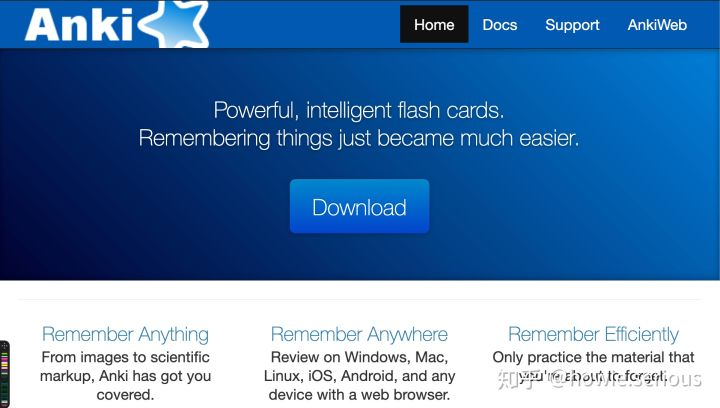
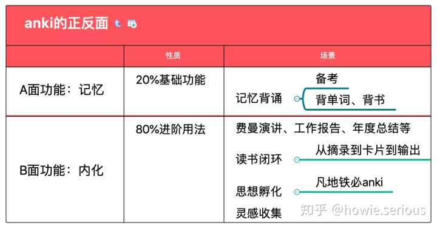

# 【Anki大法好】30000张卡片、30个月、1个方法论，这是我的Anki复盘 | d6 [知识内化](https://zhuanlan.zhihu.com/p/85450763)

7天假期，7天对费曼的严肃做工。这是《费曼学习法》第6天课程的复盘。

今天的主题，是学习闭环中第4个环节：如何快速有效搭建个人闪卡系统，训练自己的知识内化、深度思考能力？

小能熊推荐的利器，是闪卡软件Anki。

## Anki的80%价值未被挖掘

虽然Anki官方给自己的定位是「powerful intelligent flash cards」, 给自己的使命是「**让天下没有难记的知识**」(remember things just became much easier)，但是，大多数人知道anki后没有真正用起来，就是因为「记忆」这个功能定位：

- 出了学校之后，大家不需要「记忆」知识了，或者说，还需要记住新知识，但是需要死记硬背的场景已经不存在了；

但是，让知识内化、让思考深入，这是永恒的需求。而Anki的80%进阶价值，就在于此：

## 30个月后的Anki复盘

2016年5月认识杨洋博士后，我立刻开始重度使用Anki。到现在，30个月，anki里的30000张卡片构成了我的闪卡系统。但是，秉持「克制极致、善用利器」的小能熊生产力工具原则：

- Anki中的分类和命名体系，和Evernote、电脑文件保持一致；
- Anki卡片只有一种，那就是「费曼卡片」；
- 不折腾，**不当工具癖**，而是时刻围绕Anki作为「大脑健身房」、「思想孵化器」的本质。**Anki的核心操作**是：制卡、刷卡、迭代，而其他不带来实际产出的折腾基本都是工具癖。

## 费曼卡片，只有费曼卡片

什么是费曼卡片？一句话：

> 费曼技巧+Anki卡片

为什么要特别强调是**费曼**卡片？

- 只有在**以费曼为基础理念的学习闭环**中，卡片的价值才能真正发挥出来！
- 作为工具，使用Anki的方法五花八门，很多都流于形式，沦为工具癖。费曼卡片，可以帮助正本清源；
- 既然是费曼卡片了，即使不考试，不需要记忆，你也需要它。因为谁都离不开费曼，都不能停止费曼啊！

而费曼卡片带来的核心价值？

- 在浅层阅读的时代**深度思考**
- 用碎片时间**连贯思考**
- 基于高强度高质量输入的**学习闭环推进**

## Anki14字诀

Anki是通过杨洋老师了解到的。他关于Anki的分享，我只记住了14个字，我称之为「**Anki14字诀**」：

> 多感官、多渠道、间断重现、主动回想

记住这14个字，记忆这件事再也不会困扰你和孩子。脱离这14个字，你关于解决记忆问题的努力，很可能会走弯路。可以说，市面上关于记忆的流行综艺节目和炫技类记忆课程，基本上都是把人往沟里带。

### **多感官**：

视频、音频、文本、实地考察，包括英文原声电影、学习过程中不断对话、绘本以及水族馆、海滩海岛学习旅游等。学习的主题很多，但是围绕「海洋生物」这一条主线(之一，这类的主线还有其他)，多感官刺激很重要；

### **多渠道**：

电影、youtube、书籍、笔记、卡片、游戏、费曼；

### **间断重现**：

把卡片和贴纸结合起来，刷卡片不是考试，而是玩贴纸；1个材料学10遍，好过10个材料浅尝辄止。

### **主动回想**：

电影、读书、卡片、对话的过程中，全程都是输出导向，拒绝灌输式教育、拒绝死记硬背的。