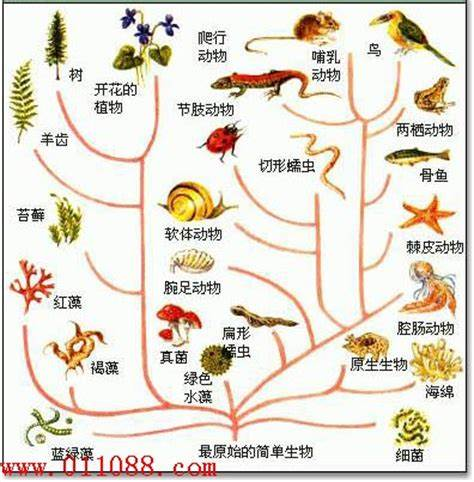
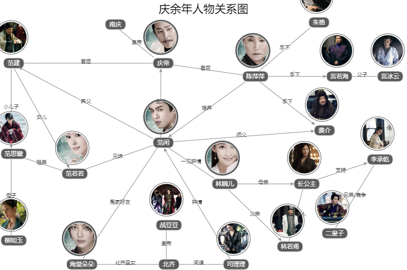
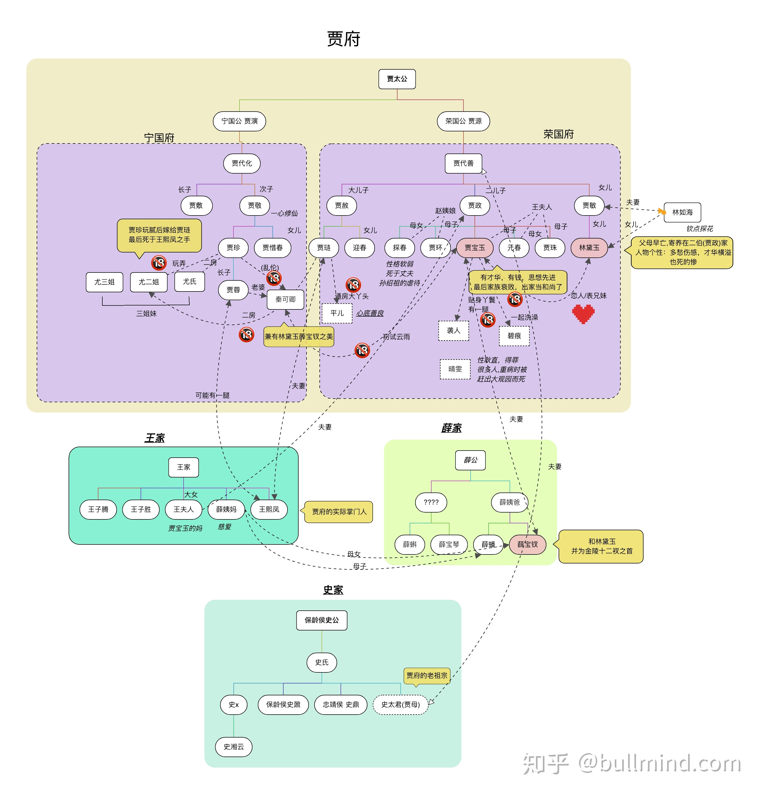

# Element

## Resource

图片，字符等但文本资源

Image	mp3

https://github.com/typora/typora-issues

https://www.bilibili.com/read/cv5523772/

- Images,
- Headers,
- Lists,
- Tables,
- Code Fences,
- Mathematics,
- Diagrams,
- Inline Styles.
- etc..

## MutliResoure

可拥有多类型资源的文件，可作为知识产出的副本快照

PDF
HTML
HTML (without styles)
WordI (docx)
OpenOfice
RTF
Epub
Lallex
MediaWiki
reStructuredlext
Textile
OPML 

etc..

# Tag

Element-Tag

元素标签 对任对象的标记

在Map图 与Tree树中的节点，可作为其**主题Subject**本身 及标记**属性Attributes** 

ps：若出现多义词，则于原Title后 追述上下文 如 Tag	-----【**白马**】

> ​				【**白马**】	是一个汉语词语，一般指白色的马。
>
> [同义词](https://baike.baidu.com/subview/71844/10028254.htm)	【**白马（古代地名，白马县）**】一般指白马县 
>
> [同义词](https://baike.baidu.com/item/%E7%99%BD%E9%A9%AC/19435510#viewPageContent)	【**白马（唐代杜甫诗作)**】《白马》是唐朝著名文学家杜甫的作品之一，出自《全唐诗》。

# Map

##### 庆余年人物关系图  【[Link](https://www.tvmao.com/drama/Yy0wHDA=/renwuguanxitu)】

##### 红楼梦人物关系图

-高清大图 - bullmind.com的文章 - 知乎 https://zhuanlan.zhihu.com/p/51105391

https://www.echartsjs.com/examples/zh/index.html#chart-type-graph

https://www.echartsjs.com/examples/zh/editor.html?c=graph

https://www.echartsjs.com/examples/zh/editor.html?c=graph-webkit-dep

# Tree

学习DOM

## HTML DOM 教程 【[Link](https://www.runoob.com/htmldom/htmldom-tutorial.html)】

DOM (Document Object Model) 译为**文档对象模型**，是 HTML 和 XML 文档的编程接口。

HTML DOM 定义了访问和操作 HTML 文档的标准方法。

DOM 以树结构表达 HTML 文档。

------

## HTML DOM 树形结构:

---

一些常用的 HTML DOM 方法：

- getElementById(id) - 获取带有指定 id 的节点（元素）
- appendChild(node) - 插入新的子节点（元素）
- removeChild(node) - 删除子节点（元素）

一些常用的 HTML DOM 属性：

- innerHTML - 节点（元素）的文本值

- parentNode - 节点（元素）的父节点

- childNodes - 节点（元素）的子节点

- attributes - 节点（元素）的属性节点

### 一些 DOM 对象方法

  这里提供一些您将在本教程中学到的常用方法：

| 方法                     | 描述                                                         |
| ------------------------ | ------------------------------------------------------------ |
| getElementById()         | 返回带有指定 ID 的元素。                                     |
| getElementsByTagName()   | 返回包含带有指定标签名称的所有元素的节点列表（集合/节点数组）。 |
| getElementsByClassName() | 返回包含带有指定类名的所有元素的节点列表。                   |
| appendChild()            | 把新的子节点添加到指定节点。                                 |
| removeChild()            | 删除子节点。                                                 |
| replaceChild()           | 替换子节点。                                                 |
| insertBefore()           | 在指定的子节点前面插入新的子节点。                           |
| createAttribute()        | 创建属性节点。                                               |
| createElement()          | 创建元素节点。                                               |
| createTextNode()         | 创建文本节点。                                               |
| getAttribute()           | 返回指定的属性值。                                           |
| setAttribute()           | 把指定属性设置或修改为指定的值。                             |

## JavaScript 和 HTML DOM [参考手册](https://www.runoob.com/jsref/jsref-tutorial.html)

# Block

# Paper

# Async Export

Evernote

OutLine

Anki

MindMap