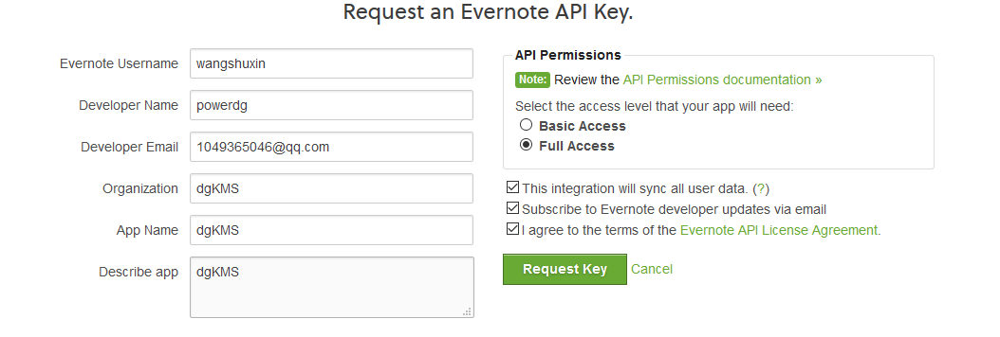

https://csharp.hotexamples.com/examples/EvernoteSDK/ENNote/-/php-ennote-class-examples.html

https://github.com/evernote/evernote-cloud-sdk-windows/blob/master/src/EvernoteSDK/ENSession.cs

https://sandbox.evernote.com/shard/s1/notestore

S=s1:U=94d05:E=17874544456:C=1711ca314f0:P=1cd:A=en-devtoken:V=2:H=9de862e9e78fe5a506dfea97a779ecb8

https://sandbox.evernote.com/api/DeveloperToken.action

#### Here is your Evernote API Key

It comes in two parts: a **Consumer Key** and a **Consumer Secret**. Both are required to authenticate with the Evernote API and receive an  authentication token. Your Consumer Secret should be kept private and  not shared.

- Consumer Key: `wangshuxin`
- Consumer Secret: `500dd1466d35b2e5`

Both of these values will be sent to you via email.

-------

Developer tokens allow you to use the Evernote API to access your personal Evernote account.        To learn more about using developer tokens, visit [dev.evernote.com](http://dev.evernote.com/documentation/cloud/chapters/Authentication.php).      

​          Protect this token as carefully as you protect your Evernote password!           Anybody with access to this token has full access to your Evernote account.          You can revoke this token at any time by returning to this page.        

​          To get started, copy the token below and paste it into your code.           It can be used as the authenticationToken parameter in any authenticated Evernote API call.           Authenticated NoteStore calls should be made to the NoteStore URL displayed below.        

​          **Please save this token in a safe spot.** After you leave this page,          if you forget or lose your token you will have to generate a new one.        

​          Developer Token          

S=s1:U=94d05:E=17841121fe0:C=170e960f350:P=1cd:A=en-devtoken:V=2:H=246db46ee45504e23699823b27600d71

​            NoteStore URL:            

https://sandbox.evernote.com/shard/s1/notestore

### Expires:

          17 March 2021, 09:43        

​        

----

