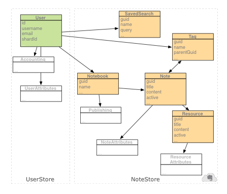

### 核心概念

#### 印象笔记云 API 的重要概念

##### 概述

​					印象笔记云 API 不同于很多 web 服务 API，但是一旦你理解了一些基本例子，就很容易使用它了。 			

- [The UserStore 和 NoteStore](https://dev.yinxiang.com/doc/articles/core_concepts.php#services)
- [使用 the SDK](https://dev.yinxiang.com/doc/articles/core_concepts.php#patterns)


###### UserStore 和 NoteStore

​				云 API 由两个逻辑服务组成：UserStore 和 NoteStore。

UserStore  管理印象笔记用户，并且第三方程序通常不使用它。

NoteStore 管理用户的印象笔记帐户内容，所以它是你要访问的服务。

本章介绍了一些使用云  API 的基本例子。一旦你理解了这些例子，你就可以利用[参考文档](https://dev.yinxiang.com/doc/reference)来查找所有关于 NoteStore 的 API。 		

​				在你使用云 API 做任何事情之前，你需要认证并得到访问某个印象笔记帐户的权限。认证在[认证章节](https://dev.yinxiang.com/doc/articles/authentication.php)详细解释了。当你成功认证后，你将得到两个你需要用来访问 NoteStore 的信息：用来访问 NoteStore 的 URL 和用来访问用户帐户的认证码。每个用户的 NoteStore 的 URL  可能不相同，所以不要把这个 URL 硬编码进代码，也不要假设它一直是不变的。 		


###### 使用 SDK

​				云 API 包含你用来访问 UserStore 和 NoteStore 的封装函数库。你需要创建一个 NoteStore.Client 对象来调用 NoteStore API 函数。 	

```java
// Retrieved during authentication:  
String authToken = ...  
String noteStoreUrl = ...  
  
String userAgent = myCompanyName + " " + myAppName + "/" + myAppVersion;  
  
THttpClient noteStoreTrans = new THttpClient(noteStoreUrl);  
userStoreTrans.setCustomHeader("User-Agent", userAgent);  
TBinaryProtocol noteStoreProt = new TBinaryProtocol(noteStoreTrans);  
NoteStore.Client noteStore = new NoteStore.Client(noteStoreProt, noteStoreProt);
```


​				除了 User-Agent 字符串外，你不需要更改上面代码的其他地方。SDK 中的样例代码展示了如何使用其他语言来做同样的事。如果要使用印象笔记 API 的某个功能，可以直接调用你刚刚创建的 NoteStore.Client 对象里对应的方法： 		

|      | `List notebooks = noteStore.listNotebooks(authToken);` |
| ---- | ------------------------------------------------------ |
|      |                                                        |

​            [view raw](https://gist.github.com/evernotegists/5313817/raw/example.java)            [example.java](https://gist.github.com/evernotegists/5313817#file-example-java)            hosted with ❤ by [GitHub](https://github.com)          

​				上面的代码调用了 [NoteStore.listNotebooks](https://dev.yinxiang.com/doc/reference/NoteStore.html#Fn_NoteStore_listNotebooks) 函数，它返回一个 [NoteStore.listNotebooks](https://dev.yinxiang.com/doc/reference/NoteStore.html#Fn_NoteStore_listNotebooks) 对象列表。服务所返回的笔记本和其他对象仅仅是一些结构－一些你可以读取和写入的独立信息的容器。所有实际的 API 调用都通过  NoteStore.Client  对象完成。当你要在一个印象笔记帐户里创建一个新对象时，你初始化一个对应的数据模型对象的实例，把你想设置的域填入对应的值，然后调用 API 函数： 		

```java
Notebook notebook = new Notebook();  
notebook.setTitle("My fancy new notebook");        
Notebook theNewNotebook = noteStore.createNotebook(authToken, notebook);` 
```


| 1            2            3            4 | `Notebook notebook = new Notebook();  notebook.setTitle("My fancy new notebook");        Notebook theNewNotebook = noteStore.createNotebook(authToken, notebook);` |
| ---------------------------------------- | ------------------------------------------------------------ |
|                                          |                                                              |

​            [view raw](https://gist.github.com/evernotegists/5313818/raw/example.java)            [example.java](https://gist.github.com/evernotegists/5313818#file-example-java)            hosted with ❤ by [GitHub](https://github.com)          

  当你在服务里创建一个新的对象时，它返回这个对象的一个实例，并且这个实例包含一个服务器为这个对象生成的唯一 ID。你将来使用这个实例的时候，你需要这个 ID。你并不需要（而且也不能够）事先填入这些 ID。

|      |      |
| ---- | ---- |
|      |      |


```java
            `String guid = theNewNotebook.getGuid();       
            Note myNewNote = new Note();  note.setNotebookGuid(guid);  
            // ...`          
```


 


​	       [view raw](https://gist.github.com/evernotegists/5313819/raw/example.java)            [example.java](https://gist.github.com/evernotegists/5313819#file-example-java)            hosted with ❤ by [GitHub](https://github.com)          

  现在你理解了使用云 API 的基本例子，你可以参考其他章节来完成更具体的需求。


### 数据模型

#### 理解印象笔记是如何存储数据的

------

##### 概述

- 云 API 允许直接访问用户帐户内的数据。
- 请[查看 API 参考](https://dev.yinxiang.com/doc/reference/Types.html)来了解所有数据对象和属性的信息。

​				下图显示了印象笔记服务为每个用户管理的主要数据对象的关键数据结构和域，还指出了不同对象之间的关系。这些对象域用户在他们帐户里看到的东西相对应：笔记，笔记本，标签等。 		

​				本页只是简单地描述了这些对象。如果要了解如何在你的应用中创建及操作这些对象，请查看本文档后面的章节。 		

​				

​					[ 						 					](https://dev.yinxiang.com/media/images/data_structure_large.png) 			


​				图中左边的结构 ([User](https://dev.yinxiang.com/doc/reference/Types.html#Struct_User), [Accounting](https://dev.yinxiang.com/doc/reference/Types.html#Struct_Accounting), [UserAttributes](https://dev.yinxiang.com/doc/reference/Types.html#Struct_UserAttributes)) 是通过 UserStore 服务访问的, 而右边的那些是通过 NoteStore 服务访问的。 		

​				所有核心的 NoteStore 对象都有一个全局唯一的标识符（GUID），这个标识符是服务在创建对象时分配的。这个标识符在对象的生命周期内永远不变，并且在 API 调用中访问对象要使用到这个标识符。 		

​				每个对象都有一个随着服务更改对象而变化的更新序列号（update sequence number,  USN）。每当更改提交时，被更改的对象都会收到一个新的 USN。在同一个帐户内， USN  的值是唯一的且单调递增的，所以一个客户端可以通过检查两个对象而得知哪个对象是最近更新的。 		

### User

​				每个印象笔记用户在服务中都由一个 [User](https://dev.yinxiang.com/doc/reference/Types.html#Struct_User) 对象所表示。 		

#### Accounting

​				每个 [User](https://dev.yinxiang.com/doc/reference/Types.html#Struct_User) 都有一系列关联的 [Accounting](https://dev.yinxiang.com/doc/reference/Types.html#Struct_Accounting) 信息。这些信息使客户端能够决定这个用户可以使用服务的级别，比如指定了一个月内这个用户可以上传新内容的字节数的每月“上传限制”。 		

### Note

一个 [Note](https://dev.yinxiang.com/doc/reference/Types.html#Struct_Note) 表示了印象笔记帐户内的一个单位信息。一条笔记由一个主体（内容）和零到多个所关联的 [Resources](https://dev.yinxiang.com/doc/reference/Types.html#Struct_Resource) (images, audio, PDF, 等等) 组成。 笔记的结构和 MIME 格式的电子邮件信息类似: 主体由超文本组成，资源由主体可以指向的嵌入的“附件”组成。

一条笔记在同一时间只能存在在一个[笔记本](https://dev.yinxiang.com/doc/reference/Types.html#Struct_Notebook)中。一条笔记不可能同时存在在两个不同的笔记本中。如果笔记被复制，那么相当于新创建一个一样的笔记。如果新的笔记被修改了，原始的笔记是不会变化的。

笔记的内容是以 Evernote Markup Language (ENML) 格式存储的一段文本。基本上 ENML 就是 XHTML 的一个子集。如果要了解这个格式的更多细节，请查看 [ENML](https://dev.yinxiang.com/doc/articles/enml.php) 章节。

即便笔记的内容看起来没有超文本，笔记仍然以 ENML 格式存储。例如，一条纯文本笔记只是一个简单的 ENML 文档，而一个图像则表示为一个指向含有图像数据的嵌入二进制资源的很小的 ENML 格式的占位符。

​					超文本中的资源（例如，图像或音频）占位符由 <en-media> 标签表示。例如：

```xml
<en-media type="audio/wav" hash="ffd93f16876049265fbaef4da268dd0e"/> 
<en-media type="image/jpeg" hash="9e107d9d372bb6826bd81d3542a419d6"/>
```


 				        [view raw](https://gist.github.com/evernotegists/5313513/raw/example.xml)            [example.xml](https://gist.github.com/evernotegists/5313513#file-example-xml)            hosted with ❤ by [GitHub](https://github.com)          

这里的 hash 属性包含一个对应资源数据的 MD5 校验码。这个校验码可以用作一个从超文本指向笔记的一个资源的没有歧义的标识符。使用这个标识符而不是 GUID 来引用资源，这样笔记和它的资源在创建和复制的时候就不必考虑在新的副本中设置正确的标识符。

注意的是，这个 HTML 标签在内容被显示前的某个时刻需要被替换成和内容一致的恰当的标签。例如，当 <en-media>  指向一个图像时，它通常被替换成一个指向对应图像的本地副本的  。这个替换过程可以发生在显示内容的时候，也可以在客户端第一次加载/更改笔记数据的时候。这个更改是平台相关的，所以此更改不是印象笔记服务生成的，也不会被发送到印象笔记服务。

每个笔记都由一系列 [NoteAttributes](https://dev.yinxiang.com/doc/reference/Types.html#Struct_NoteAttributes) 对象，这些对象保存笔记的其他信息，例如创建时间、大小、来源等。在搜索和过滤笔记时，这些对象很有用。

#### Notebook

每个用户的帐户中都至少有一个 [Notebook](https://dev.yinxiang.com/doc/reference/Types.html#Struct_Notebook) 对象。笔记本用来组织一系列 [Notes](https://dev.yinxiang.com/doc/reference/Types.html#Struct_Notebook)。 每个笔记本都有一个名字，这个名字在这个用户的帐户中是唯一的。笔记本可以组成一个笔记本组，笔记本组只能包含一个或多个笔记本，而不能包含笔记。一个用户的帐户最多可以包含 [EDAM_USER_NOTEBOOKS_MAX](https://dev.yinxiang.com/doc/reference/Limits.html#Const_EDAM_USER_NOTEBOOKS_MAX) 个笔记本。

​								**Important** 						

​    当使用印象笔记服务规定的常量（例如最大笔记本数目或名字最大长度）时，你的代码应该引用 API 封装代码里定义的常量值，而不是把这些值硬编码在你的代码中。例如，应该使用 "EDAM_USER_NOTEBOOKS_MAX" 而不是直接使用 "250"。  

每个帐户都有一个笔记本作为默认的笔记本。所有没有指定目标笔记本的新建笔记都会进入这个默认笔记本。可以通过把另一个笔记本的 default  值设置为 true 来更改默认笔记本。当一个新的笔记本被设置成默认的后，印象笔记服务自动把原来的默认笔记本的 default 值设置为  false。如果帐户中的默认笔记本被删除了，那么印象笔记服务会把创建时间最老的笔记本设置为默认笔记本。

印象笔记服务不允许删除一个用户帐户中的最后一个笔记本。这样可以保证总有一个笔记本可以用来存储新笔记。

当一个用户把一个笔记本标记为公共笔记本时，印象笔记服务给这个笔记本添加一个 [Publishing](https://dev.yinxiang.com/doc/reference/Types.html#Struct_Publishing) 结构。这个结构包含了访问和显示这个笔记本的信息，这些信息包括可以用来构造（和用户名一起）能够在网页浏览器里打开公共笔记本的 URL 的唯一 URI。

### Resource

一个 [Resource](https://dev.yinxiang.com/doc/reference/Types.html#Struct_Resource) 是一个和单一 [Note](https://dev.yinxiang.com/doc/reference/Types.html#Struct_Note) 所关联的二进制数据块，和邮件的附件很相似。资源通常包含图像、音频剪辑、PDF 文件、文档等。

每个资源类型都可能会有一系列 [ResourceAttributes](https://dev.yinxiang.com/doc/reference/Types.html#Struct_ResourceAttributes) 对象，它们描述了系统定义的属性。例如，图像资源中的 meta-data 可以从 JPEG 文件的 EXIF 块中提取出来，并保存下来作为资源的可搜索的属性。

在网页中，引用图像或其他附件的时候通常使用指向其他服务器内容的 URL。与网页不同的是，印象笔记中，资源是和对应的笔记一起存储在印象笔记服务中的。这可以使用户在不同的系统间同步数据，也保证了在笔记来源丢失或更改后仍然能访问笔记内容。

任何类型的文件都可以作为资源附加到一个笔记上，不管用户的帐户是免费帐户还是高级帐户。当创建一个资源时，必须设置一个 MIME  类型来指定文件的内容类型。下面是一些印象笔记客户端可以显示的标准类型。其他类型可能会在印象笔记客户端中以附件形式显示，并且需要一个外部的查看器/编辑器来打开。当不知道具体类型的时候，可以使用默认的 "application/octet-stream" 类型。  

- image/gif
- image/jpeg
- image/png
- audio/wav
- audio/mpeg
- audio/amr
- application/vnd.evernote.ink
- application/pdf


一个资源也可能包含一些识别数据，这些识别数据可以被用来在二进制资源（例如图像）中查找文本。每个资源的识别数据块以自定义的 "recoData"  XML 格式存储，这个格式指定了图片中的那些区域被识别出来，还包括每个区域包含的各种可能的文本。要更多地了解这些，请访问[图像识别](https://dev.yinxiang.com/doc/articles/Image_recognition.php)章节。

### Tag

每个用户帐户都包含零个或多个 [Tags](https://dev.yinxiang.com/doc/reference/Types.html#Struct_Tag)，这些标签是帮助用户查找相关笔记的组织工具。标签只能应用在 [Notes](https://dev.yinxiang.com/doc/reference/Types.html#Struct_Note) 上；[Notebooks](https://dev.yinxiang.com/doc/reference/Types.html#Struct_Notebook), [Resources](https://dev.yinxiang.com/doc/reference/Types.html#Struct_Resource) 和其他对象不能有标签。


##### Function: NoteStore.listTags

Returns a list of the tags in the account.  Evernote does not support the undeletion of tags, so this will only include active tags.

标签是印象笔记数据模型中完整的对象。一个被标记为“食物”的笔记并不保存字符串“食物”，而是包含一个指向名字为“食物”的标签对象的引用。标签的名字在用户帐户中是唯一的。如果一个笔记被标记为“食物”，那么这个标签和这个帐户中其他笔记的“食物”标签是同一个。每个标签都可以被指定给任意数目的笔记，并且每个笔记可以有任意数目的标签。

很多用户喜欢在一个线性的字母排序的列表中查找和使用他们的标签，而一些高级用户需要一个树形组织的结构来寻找一个特定的标签。数据模型包含一个简单的组织方案。在标签列表中，一个标签可以作为另一个标签的“子标签”。“子标签”和“父标签”的相对位置并不反映它们之间的任何语义上的关系。这只是一个为所有标签设计的简单的布局选项。一个没有父节点的标签被认为是用作显示和导航目的的“顶级”标签。

每个标签只能有一个父节点，所以它们不能同时在两个父节点下。如果一个“expenses”标签已经在某个帐户中存在，那么印象笔记服务器将不允许在“business”标签下再新建一个“expenses”标签。

笔记本之间共享同样的标签。如果在两个不同的笔记本中的笔记都有一个“cooking”的标签，那么这些笔记拥有相同的标签。

标签只能被用户显式地分配给笔记。标签不能根据笔记的属性自动创建，也不能作为自动搜索过滤器的一部分被创建。基于笔记属性（比如创建时间和大小）的搜索是被支持的，但是这和标签机制无关。标签机制是基于用户指定的。

### SavedSearch

每个帐户都包含零个或多个 [SavedSearches](https://dev.yinxiang.com/doc/reference/Types.html#Struct_SavedSearch)，它可以用来查找一系列符合条件的 [Notes](https://dev.yinxiang.com/doc/reference/Types.html#Struct_Note)。这些条件包括关键字组合，标签和属性。这些条件可以被保存在帐户中在将来多次使用。为了方便识别，在同一个帐户中每个保存的搜索都有一个唯一的名称。 

一个保存的搜索包含一个“查询”字符串，它包含了一个查询表达式。查询表达式使用印象笔记搜索语法，这个语法在[搜索语法](https://dev.yinxiang.com/doc/articles/search_grammar.php)章节有详细介绍。保存的搜索不过是一个被存储起来的查询；它并不和任何符合查询条件的笔记直接关联。这和标签是不同的。在数据模型中，标签和它的笔记之间有显式的关系。一个保存的搜索可以被认为式一个“智能标签”，它所关联的笔记只有在执行查询的时候才能确定。

当执行查询时，印象笔记会选出所有符合搜索条件的笔记，就好像这些条件又被手动在印象笔记客户端的搜索框中重新输入了一遍，或者发送到了 [findNotes](https://dev.yinxiang.com/doc/reference/NoteStore.html#Fn_NoteStore_findNotes) 函数一样。 


---


ENNote注释表示一个注释内的完整内容集(标题、正文、资源)。您创建并填充此对象以上载或接收下载操作的结果，此对象不指向服务上的任何特定说明;它只是内容的容器。ENNote可以使用类似于文件附件的ENResource对象数组。一个音符有一些组成音符“主体”的内容(由ENNoteContent表示)。您可以从明文、HTML等填充它。

ENNoteRef另一方面，ENoteRef是一个不可变的、不透明的引用，它指向用户帐户中存在于服务上的特定记录。当您上传ENote时，您将收到一个指向resultinq服务对象的ENNoteRef: 1响应。如果您希望将其存储以在以后访问服务通知，则此对象具有方便的函数来序列化和反序列化它。

笔记本ENNotebook表示服务上的一个记事本。它有几个属性可以告诉您它的名称、业务或共享状态等。时限

ENSession单例(可通过SharedSession访问)是SDK的主要“接口”。您将使用会话来验证使用服务的用户，而会话将公开您将用于执行Evernote操作的方法。

