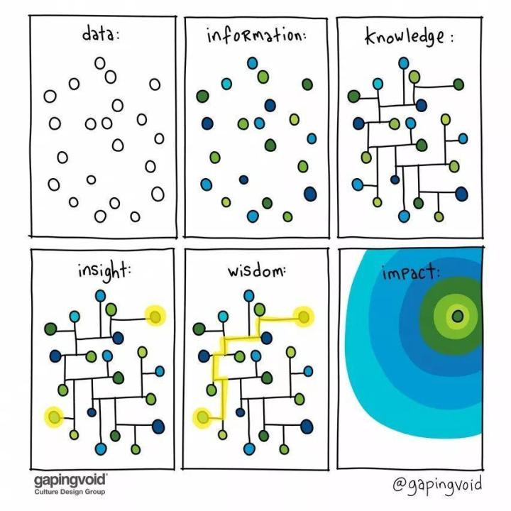

# KMS

## 需求整理

结构化-	

```
1. 少而精 2. 贴合自己当下的需求 3. 绝不主动关注任何新闻
```

输入-知道

输出-认知

基线-原子-原能力

**西蒙说，“科学第一要义是，如果有人递给你一件秘密武器，你最好用起来。 ”**

记忆力-repeat-重复 提炼

内化

记忆


大纲 tree

MindMap


## 几大

### 西蒙

**西蒙说，“科学第一要义是，如果有人递给你一件秘密武器，你最好用起来。 ”**


“知识的专一性像锥尖，精力的集中好比是锥子的作用力，时间的连续性好比是不停顿地使锥子往前钻进。”西蒙学习法所支配的学习活动，呈现出一种尖锐猛烈、持续不断的态势。

有哪些相见恨晚的高效学习方法？ - 沪江的文章 - 知乎 https://zhuanlan.zhihu.com/p/25415549

## 面板=

Knowledge面板【学科树】

- 官方认定
- 本地私人
- Map-Tree    Node
  - Title-Summary-

书签 Tag

文件doc PDF MarkDowm 自写文档


图片。文件。前置+相对Url


Tap-  card 	 papper-Item  **element**   atom

Line-Papper 

 tree MindMap	FreeMap

---


Md	Word Html

FreeMind 

Map	T-Sql

Map

----


元


## KMS


这张图，建议每个人保存。 - 曹将的文章 - 知乎 https://zhuanlan.zhihu.com/p/62128475




---

## 分分合合

### 西学为用，东学为体

**所依附于的最大组织规则决定了你的战略（东学为体

为何你学的知识都没用？因为你不了解什么叫“纹化”！（正确学习观） - 第三知眼观的文章 - 知乎 https://zhuanlan.zhihu.com/p/108381296

**以“存在”为前提基础，也就是“眼见为实”的东西。**

**无论经济、哲学、管理再到具体的为人处世、情绪调节等等，它们都把事物分割成一块一块的，各种表格、数据、曲线、逻辑组合等，看起来“有理有据”，正好符合人们“眼见为实”的这一根本人性。**


但事实呢？

这种“分割”法，用在科学技术上没问题，因为科学技术是以“存在”为基础。

但在“纹化”，也就是俗语讲的一个人怎么混社会的问题上，是没有多大用处的，只能越用越乱。

比如用西式经济学去观察楼市，屡战屡败；

比如用西式的“自我管理”法去培养自我发展，结果多是沦为“糊涂的工具”。

你所生存依附的环境是由一个个人构成的，人和人是不一样的，一个人身为企业家、老板或者身在衙门，更容易明白这个事实：

**所“牧”之群决定了你的具体方法，也就是战术（西学为用）；**

**所依附于的最大组织规则决定了你的战略（东学为体）。**


---


## INK

如何构建自己的笔记系统？ - Lachel的回答 - 知乎 https://www.zhihu.com/question/23427617/answer/28206585


---


## ithoughts


求推荐 iPad 能用的思维导图软件？ - warfalcon的回答 - 知乎 https://www.zhihu.com/question/20244590/answer/14980319

---


*请各位注意，整理的目的就是整理思想的精髓：*

**整理的目的不是单纯把东西收拾整齐，而是获得新的信息。**

这篇文章也许是最清晰简单的数学思想汇总 - 家里有只肉丸子的文章 - 知乎 https://zhuanlan.zhihu.com/p/98023181

---

作者：鬼谷
链接：https://www.zhihu.com/question/31585916/answer/373531064
来源：知乎
著作权归作者所有。商业转载请联系作者获得授权，非商业转载请注明出处。


## **什么是信息？什么是知识？**

为了严谨的区分概念，我参考了维基百科：
**[信息](https://link.zhihu.com/?target=https%3A//zh.wikipedia.org/zh/%E4%BF%A1%E6%81%AF)**（英语：Information），是一个严谨的科学术语，其定义不统一，是由它的极端复杂性决定的，获取信息的主要方法为六何法。信息的表现形式多不胜数：声音、图片、温度、体积、颜色…… 信息的类别也不计其数：电子信息、财经信息、天气信息、生物信息……。 

**[知识](https://link.zhihu.com/?target=https%3A//zh.wikipedia.org/wiki/%E7%9F%A5%E8%AF%86)**（Knowledge），是**对某个主题确信的认识，并且这些认识拥有潜在的能力为特定目的而使用**。意指透过经验或联想，而能够熟悉进而了解某件事情；这种事实或状态就称为知识，其包括认识或了解某种科学、艺术或技巧。此外，亦指透过研究、调查、观察或经验而获得的一整套知识或一系列资讯 [1]。认知事物的能力是哲学中充满争议的中心议题之一，并且拥有它自己的分支—知识论。从更加实用的层次来看，知识通常被某些人的群体所共享，在这种情况下，知识可以通过不同的方式来操作和管理。

概念是一切知识架构的基石。对概念保持高度的敏感，可以避免很多不必要入的坑。

> 在任何一个领域，对该领域中重要的概念无知，那就真的与白痴无异 —— 这事儿跟 “智商高低” 全无关系。所以，学习就是让自己变聪明的过程，习得那个领域中最重要的概念，琢磨清楚相关的方法论，就马上 “不那么白痴了”。——李笑来

区分了概念后，你也明白了需要把你搜集到的信息转化为知识，那么，下一步：**带有极强目性地去搜索需要的信息**，注意我的用词，**带有极强的目的性**，没有目的的去上网你会很容易迷失在信息的海洋里，你也一定经历过在刷知乎的时候不断地点开超链接，不断地看到新的问题一点进去，然后就忘了自己一开始点开浏览器是为了什么情况，所以：一切为了高效率，**请带有极强的目的去搜索**，上网之前试着先在纸上写下自己现在上网的目的是什么，问问自己：你需要查找什么信息？仅仅是这么一个小动作，你便可以为自己的人生节约大量的时间，这绝对是值得花费的几秒钟。

---

、


作者：家里有只肉丸子
链接：https://www.zhihu.com/question/52782284/answer/966168927
来源：知乎
著作权归作者所有。商业转载请联系作者获得授权，非商业转载请注明出处。

## 什么是认知体系？

我们首先要清楚的知道，什么是认知体系。

其实，认知体系包含两个方面**“知道”和“认知”**。

**“知道”部分**包含各种事实，数据，原理，定义，信息。这个部分庞杂具体，需要具体问题具体分析。

**“认知”**则是串联所有“知道”的核心。只有“认知”，才能利用好你的“知道”，做出判断，做出决策，做出思考和评价。

所以，**构建认知体系，就是构建“知道”和“认知”两个部分。**


作者：家里有只肉丸子
链接：https://www.zhihu.com/question/52782284/answer/966168927
来源：知乎
著作权归作者所有。商业转载请联系作者获得授权，非商业转载请注明出处。

## **人的认知体系，应该包含三类“基线知识”。**

其实如果把世界上所有知识都涵盖在一个知识库中，那基线知识可能会极多。

### **（1）“知道”类基线知识——认知体系的血肉**

对于每个具体的门类，“知道”部分的“基线知识”则不多。

比如我刚刚举例的“初中级数学”，“集合的理论，函数、方程、矩阵、微积分”就是“知道”部分的“基线知识”。那么，可以推而广之，比如经济领域的“基线知识”大多都写在“经济学原理”这本书里了。心理学的“基线知识”都写在“心理学原理”的书中。你需要分门别类的去构建这些“知识体系”当中的“基线知识”。

但是，光有“知道”远远不够。许多朋友聊起天来侃侃而谈，真正遇到未知的问题，往往无从下手。

这是因为他缺乏“认知”这部分的“基线知识”。

没错，“认知”这个部分，也有“基线知识”！

### **（2）“认知”类基线思维——认知体系的骨架**

**“认知”类的基线思维**，是构建自己认知体系的基础中的基础，我认为每个想要构建知识大厦的人都应该掌握的“基线知识”。

这里有几个十分重要的思维方式：

- 归纳整理思想（结构化思维）
- 分类讨论思想
- 逆向思维
- 转化的思维（函数思想）
- 抽象化和具体化的思维
- 辩证的思维方式

### **（3）基线思想——认知体系的灵魂**

另外，还有一部分既属于“知道”又属于“认知”，就是**对世界和个人的认知**。

**因为这部分内容包含一些“事实信息”，也包含“认知”串联。我把这部分叫做“基线思想”**。

基线思想确实复杂得多。所谓基线思想，其实就是你最根本的思想内核。比如“平等，自由，自我价值定义……”基本可以解释为“人生观、世界观、和价值观”的内核。

现在你可以知道，为什么“三观”很重要了。因为“三观”是你思想的“基线”，是最基本的思想。你的一切观点，对待任何事情的看法，其实基本上都可以通过“三观”推到得到。

## 构建认知体系的要点就是：


**“知道”类基线知识，是认知体系的血肉。血肉多少会影响认知体系，但影响不大。**

**“认知”类基线思维，是认知体系的骨架。决定整个认知体系的架构，串联所有血肉，是整个认知体系的核心！许多人认知体系的差异就在这里。**

**基线思想，是认知体系的灵魂。其实这个反而个性化很多，大多数情况下不需要特别说明。这里不多讨论。**

