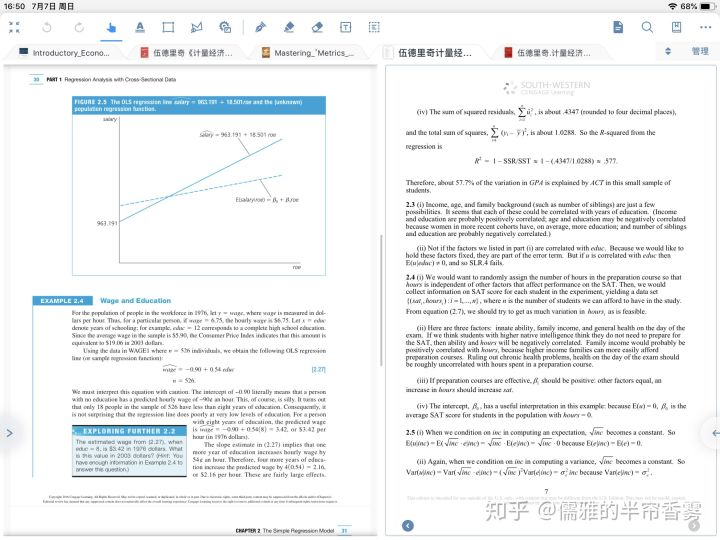
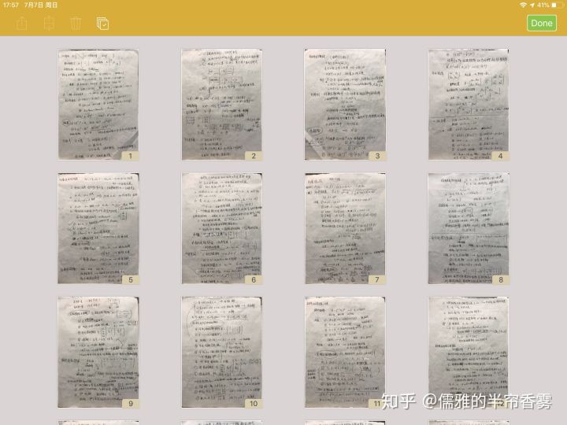

## 其他使用到的APP：**Marginnote**用来看电子课本；**Bear**用来文字记录整理；**OneNote**用来记录老师板书；

MarginNote3

## 这里我用到的软件是**Docr**，一款扫描APP

，也可以使用扫描全能王代替（两者都有免费版，Docr完整功能要30元内购，扫描全能王高级用户30元/月，个人认为docr更实惠些），我在考前用纸张重新把课本知识点重新梳理的一遍，考完试后为了预防以后需要这个笔记而找不到的情况，我把他们全部用docr扫描成PDF，然后就可以把笔记上传到云端储存。

